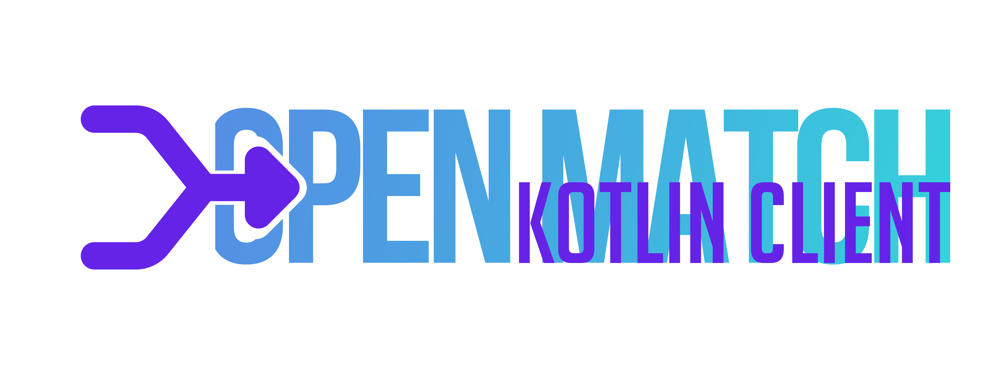

[](https://sonarcloud.io/summary/new_code?id=scrayosnet_open-match-kotlin-client "Coverage")
[](https://sonarcloud.io/summary/new_code?id=scrayosnet_open-match-kotlin-client "Reliability")
[](https://sonarcloud.io/summary/new_code?id=scrayosnet_open-match-kotlin-client "Maintainability")
[](https://sonarcloud.io/summary/new_code?id=scrayosnet_open-match-kotlin-client "Security")
[](https://discord.gg/xZ4wbuuKZf "Discord Community")

The Open Match Client provides the interface for communication with the [Open Match][open-match-project] matchmaking
service and infrastructure. The different interfaces need to be used in order to register new tickets within Open Match
and watch on changes regarding those tickets or their assignments. Each instance contacts the same (replicated) Frontend
and the API calls are relayed from there to the corresponding services of Open Match. The client stays in contact with
the Frontend throughout the whole lifetime of the instance.

We needed to implement our own Open Match client because there is no official client and the existing alternative would
be to manually implement the gRPC calls on at the game servers (frontend). Therefore, we started implementing our own
solution on-top of the Protobuf definitions that Open Match already provides. We'll try to update the Open Match
mappings every time that there is an API change.

## Major Features

* **Idiomatic Kotlin API** – Fully embraces Kotlin's language features while remaining Java-compatible.
* **Simple Client Bootstrap** – Just initialize
  `GrpcOpenMatchClient()` — host/port via environment variables, no extra config needed.
* **Ticket Management** – Create, fetch, delete, and stream ticket updates via the Open Match Frontend.
* **Assignment Streaming** – Listen for matchmaking results in real-time using Flow-based streams.
* **Pluggable gRPC Runtime** – Compatible with multiple gRPC transports (`grpc-netty`, `grpc-netty-shaded`, etc.).
* **Protobuf-First Design** – Built directly on Open Match’s official Protobuf definitions. Auto-updated on API changes.
* **Maven Central Distribution** – No custom repository setup required — just add the dependency and go.

## Getting started

In order to use this Client, your application needs to have access to the frontend container of
[Open Match][open-match-project] and this instance needs to have [gRPC][grpc-docs] enabled. These are both the default
scenarios, so you should be good to go and need no further setup.

### Dependency

After your instance is up and running, you have to add Open Match Kotlin Client to your dependencies:

```kotlin
dependencies {
    // make sure to specify the latest version
    api("net.scrayos", "open-match-kotlin-client", "5.1.0-SNAPSHOT")

    // choose your own gRPC runtime or use an existing one
    runtimeOnly("io.grpc", "grpc-netty", "1.72.0")
}
```

Instead of `grpc-netty` you may also use `grpc-netty-shaded` (which hides the transitive Netty dependency) or any other
compatible gRPC runtime. We recommend sticking with the default runtime but in theory, Open Match Client should be
compatible with either runtime.

Since the Open Match Client is deployed to the official Maven Central repository, you don't need to include any special
repositories:

```kotlin
repositories {
    mavenCentral()
}
```

After reloading your Gradle project, you should now be able to retrieve all related classes.

### Usage

Below you can find a guide on obtaining an `OpenMatchClient`, the central interface to perform operations through the
[Open Match][open-match-project] Frontend. Please use the version, appropriate for your language (Java/Kotlin).

#### Kotlin

```kotlin
// host and port are supplied by the default environment variables
val client = GrpcOpenMatchClient()

// any request can be performed on the client while it is open
client.deleteTicket("ticket-id")
```

#### Java

```java
// host and port are supplied by the default environment variables
OpenMatchClient client = new GrpcOpenMatchClient();

// any request can be performed on the client while it is open
client.deleteTicket("ticket-id");
```

## Reporting Security Issues

To report a security issue for this project, please note our [Security Policy][security-policy].

## Code of Conduct

Participation in this project comes under the [Contributor Covenant Code of Conduct][code-of-conduct].

## How to contribute

Thanks for considering contributing to this project! In order to submit a Pull Request, please read
our [contributing][contributing-guide] guide. This project is in active development, and we're always happy to receive
new contributions!

## License

This project is developed and distributed under the MIT License. See [this explanation][mit-license-doc] for a rundown
on what that means.


[grpc-docs]: https://grpc.io/

[open-match-project]: https://open-match.dev/site/

[suspend-from-java]: https://www.baeldung.com/kotlin/suspend-functions-from-java

[semver-docs]: https://semver.org/lang/de/

[security-policy]: SECURITY.md

[code-of-conduct]: CODE_OF_CONDUCT.md

[contributing-guide]: CONTRIBUTING.md

[mit-license-doc]: https://choosealicense.com/licenses/mit/
